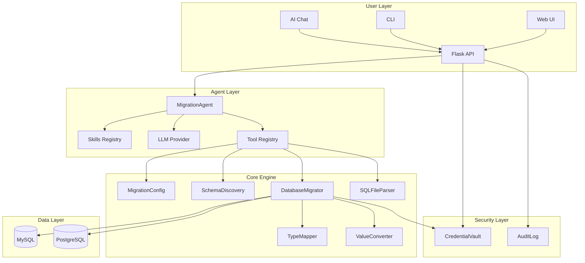
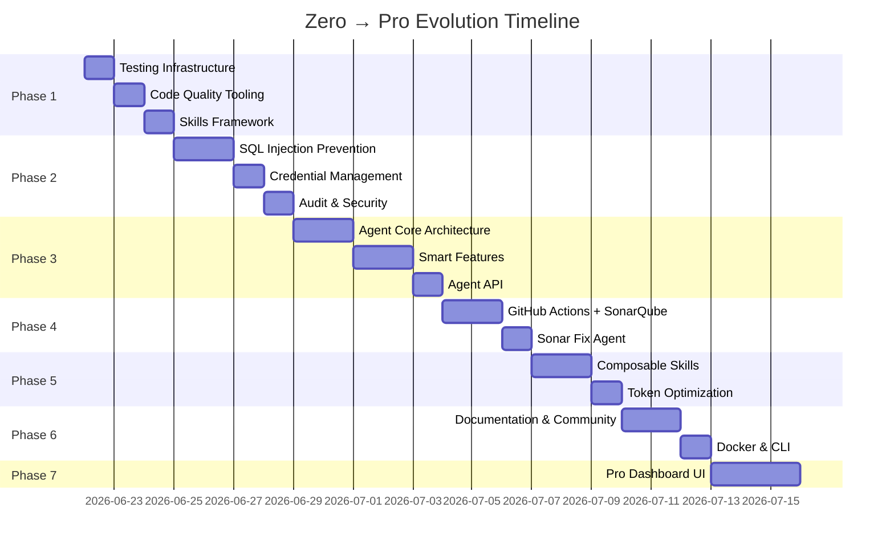

# 🐉 LongPd.DynamicDBMigrator: Zero → Pro Evolution Plan

Biến đổi công cụ migration MySQL→PostgreSQL hiện tại thành một **AI-Enhanced, Production-Grade, Community-Ready Platform** — tích hợp công nghệ agent AI, SonarQube CI/CD, Cyber Security, và Skills framework.

---

## Tổng quan Hiện trạng

| Dimension | Current State | Target State |
|:---|:---|:---|
| **Architecture** | Monolith Flask + in-memory task state | Modular plugin-based with agent loop |
| **Security** | f-string SQL, no credential vault | Parameterized queries, secrets vault, TLS |
| **Testing** | None (manual checks only) | pytest + TDD + coverage gate ≥80% |
| **CI/CD** | None | GitHub Actions + SonarQube auto-fix |
| **AI Integration** | None | Smart mapping suggestions, anomaly detection |
| **Community** | Private repo | OSS-ready: docs, CONTRIBUTING, LICENSE |
| **Skills/Agent** | Basic AGENTS.md | Full superpowers-style skill framework |

---

## User Review Required

> [!IMPORTANT]
> **Phase Ordering**: Tôi đề xuất thực hiện tuần tự Phase 1→7 vì mỗi phase là nền tảng cho phase sau. Bạn có muốn thay đổi thứ tự ưu tiên hoặc skip phase nào không?

> [!WARNING]
> **Breaking Changes trong Phase 2 (Security)**:
> - Connection config sẽ chuyển từ JSON payload sang environment-based + encrypted vault
> - API response shape cho `/api/migrate/start` sẽ thêm fields mới (backward compatible)
> - `mapping_config.json` sẽ thêm section `security` mới (không xóa key cũ)

> [!CAUTION]
> **Phase 4 (SonarQube)** yêu cầu:
> - Tài khoản SonarQube Cloud hoặc self-hosted instance
> - GitHub repository (public/private) với Actions enabled
> - Bạn đã có sẵn chưa, hay cần setup từ đầu?

## Open Questions

> [!IMPORTANT]
> 1. **LLM Provider**: Cho Phase 3 (AI Agent), bạn muốn dùng provider nào? (OpenAI, Google Gemini, local Ollama, hoặc multi-provider?)
> 2. **SonarQube**: Self-hosted hay Cloud? Nếu đã có instance, cho tôi URL.
> 3. **Target Database Support**: Có muốn mở rộng thêm target ngoài PostgreSQL không? (MongoDB, SQL Server, etc.)
> 4. **Language**: Documentation và UI messages giữ tiếng Việt hay chuyển song ngữ Việt-Anh?
> 5. **Deployment**: Cuối cùng deploy lên đâu? Docker? Cloud? Hay vẫn local tool?

---

## Proposed Changes

## Phase 1: Foundation & Engineering Discipline 🏗️
*Thời lượng ước tính: 2-3 ngày*

Xây dựng nền tảng engineering discipline theo phương pháp **obra/superpowers** (TDD, structured workflow) và **mattpocock/skills** (composable, context-aware).

---

### 1.1 Testing Infrastructure

#### [NEW] [requirements.txt](file:///d:/Projects/MY-Dragon-agent/LongPd.DynamicDBMigrator/requirements.txt)
Lock dependencies với pinned versions:
```
flask>=3.0,<4.0
mysql-connector-python>=9.0
psycopg2-binary>=2.9
python-dotenv>=1.0
pytest>=8.0
pytest-cov>=5.0
ruff>=0.8
bandit>=1.8          # security linter
```

#### [NEW] [tests/\_\_init\_\_.py](file:///d:/Projects/MY-Dragon-agent/LongPd.DynamicDBMigrator/tests/__init__.py)
Empty init file for pytest discovery.

#### [NEW] [tests/conftest.py](file:///d:/Projects/MY-Dragon-agent/LongPd.DynamicDBMigrator/tests/conftest.py)
Shared pytest fixtures:
- `sample_config()` — in-memory MigrationConfig with known test data
- `sample_sql_dump()` — temp file with minimal CREATE TABLE + INSERT
- `mock_mysql_conn()` / `mock_pg_conn()` — mocked DB connections

#### [NEW] [tests/test_config.py](file:///d:/Projects/MY-Dragon-agent/LongPd.DynamicDBMigrator/tests/test_config.py)
Unit tests cho `MigrationConfig`:
- Load/save round-trip
- v1→v2 migration
- Column mapping queries
- Edge cases: missing keys, empty file, unicode

#### [NEW] [tests/test_sql_parser.py](file:///d:/Projects/MY-Dragon-agent/LongPd.DynamicDBMigrator/tests/test_sql_parser.py)
Unit tests cho `SQLFileParser`:
- CREATE TABLE parsing (various column types)
- INSERT value tokenizer (nested JSON, Vietnamese text, escaped quotes)
- Multi-table file parsing
- Ignored columns filtering

#### [NEW] [tests/test_type_mapper.py](file:///d:/Projects/MY-Dragon-agent/LongPd.DynamicDBMigrator/tests/test_type_mapper.py)
Full coverage cho `TypeMapper`:
- Exact matches, pattern matches, overrides, fallback

#### [NEW] [tests/test_value_converter.py](file:///d:/Projects/MY-Dragon-agent/LongPd.DynamicDBMigrator/tests/test_value_converter.py)
Every transform type + edge cases:
- NullToBool, EnumToInt, JsonNormalize, Timestamp, UUID, etc.
- Pattern matching in `_CompiledRule`
- Config-driven vs auto-convert priority

#### [NEW] [tests/test_discovery.py](file:///d:/Projects/MY-Dragon-agent/LongPd.DynamicDBMigrator/tests/test_discovery.py)
Schema discovery + mapping suggestion tests:
- `from_sql_file()` with various dump formats
- `suggest_mapping()` exact/fuzzy/unmatched cases
- Column conflict resolution

#### [NEW] [tests/test_web_api.py](file:///d:/Projects/MY-Dragon-agent/LongPd.DynamicDBMigrator/tests/test_web_api.py)
Flask test client integration tests:
- All API endpoints (discover, mapping, migrate)
- Error handling (missing params, invalid payload)
- Task lifecycle (start → poll → complete/fail)

---

### 1.2 Code Quality Tooling

#### [NEW] [pyproject.toml](file:///d:/Projects/MY-Dragon-agent/LongPd.DynamicDBMigrator/pyproject.toml)
Unified config for ruff, pytest, coverage:
```toml
[tool.ruff]
line-length = 120
target-version = "py38"

[tool.ruff.lint]
select = ["E", "W", "F", "I", "S", "B", "UP"]  # including Security checks

[tool.pytest.ini_options]
testpaths = ["tests"]
addopts = "--cov=db_migrator --cov=web --cov-report=term-missing --cov-fail-under=80"

[tool.bandit]
targets = ["db_migrator", "web"]
```

#### [NEW] [Makefile](file:///d:/Projects/MY-Dragon-agent/LongPd.DynamicDBMigrator/Makefile)
Dev workflow shortcuts:
```makefile
test:     pytest
lint:     ruff check . && bandit -r db_migrator web
format:   ruff format .
security: bandit -r db_migrator web -ll
all:      lint test security
```

---

### 1.3 Skills Framework (obra/superpowers + mattpocock/skills inspired)

#### [NEW] [.skills/SKILL-planning.md](file:///d:/Projects/MY-Dragon-agent/LongPd.DynamicDBMigrator/.skills/SKILL-planning.md)
Skill file cho Planning phase — bắt buộc agent lập plan trước khi code.

#### [NEW] [.skills/SKILL-tdd.md](file:///d:/Projects/MY-Dragon-agent/LongPd.DynamicDBMigrator/.skills/SKILL-tdd.md)
TDD workflow: Red → Green → Refactor → Verify.

#### [NEW] [.skills/SKILL-security-review.md](file:///d:/Projects/MY-Dragon-agent/LongPd.DynamicDBMigrator/.skills/SKILL-security-review.md)
Security checklist cho mọi PR: SQL injection, credential leaks, input validation.

#### [NEW] [.skills/SKILL-migration-debugging.md](file:///d:/Projects/MY-Dragon-agent/LongPd.DynamicDBMigrator/.skills/SKILL-migration-debugging.md)
Domain-specific debugging skill cho migration errors, type mismatches, encoding issues.

#### [MODIFY] [AGENTS.md](file:///d:/Projects/MY-Dragon-agent/LongPd.DynamicDBMigrator/AGENTS.md)
Thêm sections:
- `## Skills` — reference tới `.skills/` directory
- `## Testing` — `make test` workflow
- `## Code Quality` — `make lint` + `make security`

#### [NEW] [CONTEXT.md](file:///d:/Projects/MY-Dragon-agent/LongPd.DynamicDBMigrator/CONTEXT.md)
Domain glossary theo phong cách mattpocock (critical cho AI agent alignment):
- Source DB, Target DB, Table Mapping, Column Mapping, Value Transform
- Migration Strategy definitions (truncate_insert, upsert, append)
- Config-driven architecture explanation

---

## Phase 2: Security Hardening (Cyber Security) 🔒
*Thời lượng ước tính: 3-4 ngày*

Đây là phase **critical nhất** cho mục tiêu Cyber Security. Giải quyết SQL injection risks, credential management, và audit trails.

---

### 2.1 SQL Injection Prevention

#### [MODIFY] [migrator.py](file:///d:/Projects/MY-Dragon-agent/LongPd.DynamicDBMigrator/db_migrator/migrator.py)

**Vấn đề hiện tại** (CRITICAL):
```python
# Line 316-317: f-string SQL — SQL INJECTION RISK
sql = f"INSERT INTO `{table}` ({cols_str}) VALUES ({placeholders})"

# Line 381: f-string DELETE — SQL INJECTION RISK  
cursor.execute(f'DELETE FROM "{schema}"."{pg_table}"')

# Line 526-549: f-string batch INSERT — SQL INJECTION RISK
insert_sql = f"""INSERT INTO "{schema}"."{pg_table}" ..."""
```

**Thay đổi**:
- Dùng `psycopg2.sql.Identifier` và `psycopg2.sql.SQL` cho PostgreSQL queries
- Dùng parameterized queries cho MySQL (đã dùng `%s` cho values, nhưng table/column names cần sanitize)
- Thêm `_sanitize_identifier()` helper — whitelist chỉ `[a-zA-Z0-9_-]`
- Batch insert chuyển sang `execute_values()` từ `psycopg2.extras` (cũng nhanh hơn ~5x)

#### [MODIFY] [discovery.py](file:///d:/Projects/MY-Dragon-agent/LongPd.DynamicDBMigrator/db_migrator/discovery.py)
- Sanitize table names từ SQL file parsing trước khi dùng trong queries
- Validate schema name input

#### [MODIFY] [sql_parser.py](file:///d:/Projects/MY-Dragon-agent/LongPd.DynamicDBMigrator/db_migrator/sql_parser.py)
- Thêm input validation cho file paths (path traversal prevention)
- Limit file size check trước khi read toàn bộ vào memory

---

### 2.2 Credential Management

#### [NEW] [db_migrator/security.py](file:///d:/Projects/MY-Dragon-agent/LongPd.DynamicDBMigrator/db_migrator/security.py)
Credential vault module:
```python
class CredentialVault:
    """Secure credential management with multiple backends."""
    
    def get_connection_config(self, alias: str) -> dict:
        """Load DB credentials from secure storage."""
        # Priority: ENV vars → .env file → encrypted vault file
        
    def encrypt_config(self, config: dict) -> bytes:
        """Encrypt sensitive config using Fernet symmetric encryption."""
        
    def decrypt_config(self, data: bytes) -> dict:
        """Decrypt config back to dict."""
```

Hỗ trợ 3 backends:
1. **Environment variables** — `MYSQL_HOST`, `MYSQL_PASSWORD`, etc.
2. **`.env` file** — via python-dotenv (dev/local)
3. **Encrypted vault** — `credentials.vault` file encrypted with Fernet key

#### [NEW] [.env.example](file:///d:/Projects/MY-Dragon-agent/LongPd.DynamicDBMigrator/.env.example)
Template cho environment variables (không chứa real values):
```env
# MySQL Source
MYSQL_HOST=localhost
MYSQL_PORT=3306
MYSQL_DATABASE=my_database
MYSQL_USER=root
MYSQL_PASSWORD=changeme

# PostgreSQL Target
PG_HOST=localhost
PG_PORT=5432
PG_DATABASE=target_db
PG_USER=postgres
PG_PASSWORD=changeme
PG_SCHEMA=public

# Security
VAULT_KEY=         # Auto-generated on first run
FLASK_SECRET_KEY=  # For session security
```

#### [MODIFY] [.gitignore](file:///d:/Projects/MY-Dragon-agent/LongPd.DynamicDBMigrator/.gitignore)
Thêm:
```
.env
.env.*
credentials.vault
*.key
```

---

### 2.3 Audit Trail & Logging

#### [NEW] [db_migrator/audit.py](file:///d:/Projects/MY-Dragon-agent/LongPd.DynamicDBMigrator/db_migrator/audit.py)
Structured audit logging:
```python
class MigrationAuditLog:
    """Immutable audit trail for all migration operations."""
    
    def log_event(self, event_type, details, user=None):
        """Log migration event with timestamp, user, and details."""
        
    def log_migration_start(self, task_id, tables, strategy, source, target):
        """Record migration initiation."""
        
    def log_migration_complete(self, task_id, stats, duration):
        """Record migration completion with stats."""
        
    def log_security_event(self, event_type, details):
        """Record security-relevant events (login, config change, etc.)."""
```

Output formats: JSON Lines file (`audit.jsonl`) + optional structured logging to stdout.

#### [MODIFY] [web/app.py](file:///d:/Projects/MY-Dragon-agent/LongPd.DynamicDBMigrator/web/app.py)
- Thêm audit logging cho mọi API endpoint
- Rate limiting cơ bản cho API calls
- Input validation middleware cho tất cả JSON payloads
- CORS configuration
- Security headers (X-Content-Type-Options, X-Frame-Options, etc.)

---

### 2.4 Connection Security

#### [MODIFY] [migrator.py](file:///d:/Projects/MY-Dragon-agent/LongPd.DynamicDBMigrator/db_migrator/migrator.py)
- Enforce SSL/TLS cho database connections khi `ssl_mode` được config
- Connection timeout settings
- Connection pooling preparation (interface cho Phase 6)

---

## Phase 3: AI Agent Integration (Smart Migration Assistant) 🤖
*Thời lượng ước tính: 4-5 ngày*

Tích hợp AI Agent loop theo pattern **ReAct + Tool Use + Reflection** để tạo Smart Migration Assistant.

---

### 3.1 Agent Core Architecture

#### [NEW] [db_migrator/agent/\_\_init\_\_.py](file:///d:/Projects/MY-Dragon-agent/LongPd.DynamicDBMigrator/db_migrator/agent/__init__.py)
Public exports cho agent module.

#### [NEW] [db_migrator/agent/core.py](file:///d:/Projects/MY-Dragon-agent/LongPd.DynamicDBMigrator/db_migrator/agent/core.py)
Main agent loop — **ReAct pattern** implementation:
```python
class MigrationAgent:
    """AI-powered migration assistant with agentic loop."""
    
    def __init__(self, llm_provider, tools, max_rounds=10):
        self.llm = llm_provider
        self.tools = ToolRegistry(tools)
        self.max_rounds = max_rounds
        self.memory = ConversationMemory()
    
    async def run(self, task: str) -> AgentResult:
        """Execute agentic loop: Perceive → Reason → Plan → Act → Observe"""
        for round in range(self.max_rounds):
            # 1. Reason about current state
            thought = await self.llm.reason(self.memory.context())
            
            # 2. Decide action (tool call or final answer)
            action = thought.next_action
            
            if action.is_final:
                return AgentResult(answer=action.content)
            
            # 3. Execute tool
            observation = await self.tools.execute(action.tool, action.args)
            
            # 4. Add to memory
            self.memory.add(thought, action, observation)
            
            # 5. Reflection (self-QA)
            if round > 0 and round % 3 == 0:
                reflection = await self._reflect()
                self.memory.add_reflection(reflection)
        
        return AgentResult(answer="Max rounds reached", status="incomplete")
```

#### [NEW] [db_migrator/agent/tools.py](file:///d:/Projects/MY-Dragon-agent/LongPd.DynamicDBMigrator/db_migrator/agent/tools.py)
AI Agent tools — các "actions" mà agent có thể thực hiện:

| Tool | Description |
|:---|:---|
| `analyze_schema` | Phân tích schema source/target, tìm patterns |
| `suggest_mapping` | Gợi ý mapping dựa trên schema analysis + LLM reasoning |
| `detect_anomalies` | Phát hiện data anomalies trước khi migrate |
| `validate_transform` | Kiểm tra value transform rules có chính xác không |
| `estimate_migration` | Ước tính thời gian và resources cần thiết |
| `explain_error` | Phân tích migration error và gợi ý fix |
| `generate_transform_rule` | Tự động sinh transform rule từ data samples |
| `security_check` | Kiểm tra security issues trong config |

#### [NEW] [db_migrator/agent/llm_provider.py](file:///d:/Projects/MY-Dragon-agent/LongPd.DynamicDBMigrator/db_migrator/agent/llm_provider.py)
Multi-provider LLM abstraction:
```python
class LLMProvider(ABC):
    """Abstract base for LLM providers."""
    async def reason(self, context: str) -> Thought: ...
    async def generate(self, prompt: str) -> str: ...

class OpenAIProvider(LLMProvider): ...
class GeminiProvider(LLMProvider): ...
class OllamaProvider(LLMProvider): ...  # Local, free
```

Token optimization:
- Context window management (giữ conversation trong "smart zone")
- Sliding window summarization khi context quá dài
- Tool result compression
- Schema fingerprinting (hash thay vì gửi full schema mỗi lần)

#### [NEW] [db_migrator/agent/memory.py](file:///d:/Projects/MY-Dragon-agent/LongPd.DynamicDBMigrator/db_migrator/agent/memory.py)
Conversation memory với token-aware management:
```python
class ConversationMemory:
    """Token-optimized conversation memory."""
    
    def context(self, max_tokens=4000) -> str:
        """Build context string within token budget."""
        
    def summarize_old(self):
        """Compress old messages to save token budget."""
```

---

### 3.2 Smart Features

#### [NEW] [db_migrator/agent/smart_mapper.py](file:///d:/Projects/MY-Dragon-agent/LongPd.DynamicDBMigrator/db_migrator/agent/smart_mapper.py)
AI-enhanced schema mapping:
- Phân tích column names + data types + sample data
- Sử dụng LLM để hiểu domain semantics (vd: `deletedAt` → `is_deleted`)
- Confidence scoring cho mỗi suggestion
- Học từ user corrections (feedback loop)

#### [NEW] [db_migrator/agent/anomaly_detector.py](file:///d:/Projects/MY-Dragon-agent/LongPd.DynamicDBMigrator/db_migrator/agent/anomaly_detector.py)
Pre-migration data quality check:
- Detect orphaned foreign keys
- Find encoding issues (mojibake detection)
- Identify data truncation risks (varchar(50) → varchar(30))
- Flag suspicious NULL patterns
- Date range validation

#### [NEW] [db_migrator/agent/error_explainer.py](file:///d:/Projects/MY-Dragon-agent/LongPd.DynamicDBMigrator/db_migrator/agent/error_explainer.py)
Migration error analysis:
- Parse PostgreSQL error messages
- Correlate with source data
- Suggest remediation steps
- Auto-generate transform rules to fix common errors

---

### 3.3 Agent API Endpoints

#### [MODIFY] [web/app.py](file:///d:/Projects/MY-Dragon-agent/LongPd.DynamicDBMigrator/web/app.py)
Thêm API routes:
```python
@app.route('/api/agent/chat', methods=['POST'])
def agent_chat():
    """Interactive chat with migration agent."""

@app.route('/api/agent/analyze', methods=['POST'])
def agent_analyze():
    """Run pre-migration analysis."""

@app.route('/api/agent/suggest-fix', methods=['POST'])
def agent_suggest_fix():
    """Get AI-powered fix for migration error."""
```

---

## Phase 4: SonarQube CI/CD Quality Gate 🔍
*Thời lượng ước tính: 2-3 ngày*

Tích hợp SonarQube theo flow mà bạn đã chia sẻ — automated fix với agent loop.

---

### 4.1 GitHub Actions Workflows

#### [NEW] [.github/workflows/ci.yml](file:///d:/Projects/MY-Dragon-agent/LongPd.DynamicDBMigrator/.github/workflows/ci.yml)
Main CI pipeline:
```yaml
name: CI Pipeline
on: [push, pull_request]
jobs:
  quality:
    runs-on: ubuntu-latest
    steps:
      - uses: actions/checkout@v4
        with: { fetch-depth: 0 }
      - uses: actions/setup-python@v5
        with: { python-version: '3.11' }
      - run: pip install -r requirements.txt
      - run: make lint          # ruff + bandit
      - run: make test          # pytest + coverage
      - name: SonarQube Scan
        uses: SonarSource/sonarqube-scan-action@v5
        env:
          SONAR_TOKEN: ${{ secrets.SONAR_TOKEN }}
          SONAR_HOST_URL: ${{ secrets.SONAR_HOST_URL }}
```

#### [NEW] [.github/workflows/sonar-autofix.yml](file:///d:/Projects/MY-Dragon-agent/LongPd.DynamicDBMigrator/.github/workflows/sonar-autofix.yml)
Auto-fix workflow theo flowchart bạn chia sẻ:
```
ENTRY(cron) → PRELOAD tracking indexes
  → RECONCILE sonar→github issues
  → CLASSIFY + ensure tracking issues
  → CHECKPOINT (skip completed)
  → FAN_OUT (max fixes per run, semaphore)
    → Per-issue HANDLE:
       _fixer_phase → quality_gate(ruff+pytest)
         → pass → PUSH (commit + PR)
         → fail + round < max → retry fixer
         → rounds exhausted → label quality-gate-failed
       → REVIEWER phase → verdict
         → LGTM → await human merge
         → REQUEST_CHANGES → retry
         → escalate → label needs-human
```

#### [NEW] [.github/workflows/sonar-fix-comment.yml](file:///d:/Projects/MY-Dragon-agent/LongPd.DynamicDBMigrator/.github/workflows/sonar-fix-comment.yml)
Comment-triggered fix: `/sonar` command in PR comments.

#### [NEW] [.github/workflows/sonar-fix-merged.yml](file:///d:/Projects/MY-Dragon-agent/LongPd.DynamicDBMigrator/.github/workflows/sonar-fix-merged.yml)
Post-merge sync: accept SonarQube issues + close tracking issues.

---

### 4.2 SonarQube Configuration

#### [NEW] [sonar-project.properties](file:///d:/Projects/MY-Dragon-agent/LongPd.DynamicDBMigrator/sonar-project.properties)
```properties
sonar.projectKey=LongPd_DynamicDBMigrator
sonar.projectName=LongPd.DynamicDBMigrator
sonar.sources=db_migrator,web
sonar.tests=tests
sonar.python.coverage.reportPaths=coverage.xml
sonar.python.version=3.8
sonar.exclusions=**/alldatapostgre/**,**/__pycache__/**
```

---

### 4.3 Sonar Fix Agent

#### [NEW] [tools/sonar_agent/\_\_init\_\_.py](file:///d:/Projects/MY-Dragon-agent/LongPd.DynamicDBMigrator/tools/sonar_agent/__init__.py)

#### [NEW] [tools/sonar_agent/fixer.py](file:///d:/Projects/MY-Dragon-agent/LongPd.DynamicDBMigrator/tools/sonar_agent/fixer.py)
The fixer phase — sử dụng AI agent để fix SonarQube issues:
```python
class SonarFixer:
    """AI-powered SonarQube issue fixer."""
    
    async def fix_issue(self, issue_key, rule_data, source_data):
        """Attempt to fix a single SonarQube issue."""
        # 1. Analyze rule + source context
        # 2. Generate fix via LLM
        # 3. Apply fix to source file
        # 4. Run quality gate (ruff + pytest)
        # 5. Return result
```

#### [NEW] [tools/sonar_agent/reviewer.py](file:///d:/Projects/MY-Dragon-agent/LongPd.DynamicDBMigrator/tools/sonar_agent/reviewer.py)
The reviewer phase — AI reviews the fix before merging.

#### [NEW] [tools/sonar_agent/reconciler.py](file:///d:/Projects/MY-Dragon-agent/LongPd.DynamicDBMigrator/tools/sonar_agent/reconciler.py)
Sync SonarQube issues ↔ GitHub Issues.

---

## Phase 5: Advanced Agent Skills & Token Optimization 🧠
*Thời lượng ước tính: 3-4 ngày*

Nâng cấp agent framework với composable skills và token optimization techniques.

---

### 5.1 Composable Skills System

#### [NEW] [db_migrator/agent/skills/\_\_init\_\_.py](file:///d:/Projects/MY-Dragon-agent/LongPd.DynamicDBMigrator/db_migrator/agent/skills/__init__.py)

#### [NEW] [db_migrator/agent/skills/base.py](file:///d:/Projects/MY-Dragon-agent/LongPd.DynamicDBMigrator/db_migrator/agent/skills/base.py)
Skill framework:
```python
class Skill(ABC):
    """Composable AI agent skill."""
    name: str
    description: str
    trigger_patterns: list[str]  # Auto-activate based on context
    
    @abstractmethod
    async def execute(self, context: SkillContext) -> SkillResult: ...

class SkillRegistry:
    """Auto-discovery and routing of skills."""
    def match(self, user_input: str) -> list[Skill]: ...
    def execute_chain(self, skills: list[Skill], context): ...
```

#### [NEW] [db_migrator/agent/skills/schema_analysis.py](file:///d:/Projects/MY-Dragon-agent/LongPd.DynamicDBMigrator/db_migrator/agent/skills/schema_analysis.py)
Skill: Deep schema analysis — tìm patterns, suggest optimizations.

#### [NEW] [db_migrator/agent/skills/data_profiling.py](file:///d:/Projects/MY-Dragon-agent/LongPd.DynamicDBMigrator/db_migrator/agent/skills/data_profiling.py)
Skill: Data profiling — sample data, detect distributions, find outliers.

#### [NEW] [db_migrator/agent/skills/migration_planning.py](file:///d:/Projects/MY-Dragon-agent/LongPd.DynamicDBMigrator/db_migrator/agent/skills/migration_planning.py)
Skill: Generate detailed migration plan with dependency ordering.

#### [NEW] [db_migrator/agent/skills/rollback_strategy.py](file:///d:/Projects/MY-Dragon-agent/LongPd.DynamicDBMigrator/db_migrator/agent/skills/rollback_strategy.py)
Skill: Generate rollback scripts for each migration step.

#### [NEW] [db_migrator/agent/skills/performance_tuning.py](file:///d:/Projects/MY-Dragon-agent/LongPd.DynamicDBMigrator/db_migrator/agent/skills/performance_tuning.py)
Skill: Analyze and optimize batch sizes, connection pooling, index usage.

---

### 5.2 Token Optimization Engine

#### [NEW] [db_migrator/agent/token_optimizer.py](file:///d:/Projects/MY-Dragon-agent/LongPd.DynamicDBMigrator/db_migrator/agent/token_optimizer.py)
Advanced token management:
```python
class TokenOptimizer:
    """Minimize token usage while maximizing context quality."""
    
    def compress_schema(self, schema: SchemaInfo) -> str:
        """Compact schema representation: 'tbl(col1:type, col2:type)'"""
        
    def fingerprint_table(self, table_data: TableData) -> str:
        """Generate content-addressable fingerprint for caching."""
        
    def sliding_summary(self, messages: list, budget: int) -> str:
        """Summarize oldest messages to fit within token budget."""
        
    def delta_context(self, prev_state, curr_state) -> str:
        """Send only changed parts of context (delta encoding)."""
```

---

## Phase 6: Community Readiness (Open Source) 🌍
*Thời lượng ước tính: 2-3 ngày*

Chuẩn bị project cho cộng đồng open source.

---

### 6.1 Documentation

#### [MODIFY] [README.md](file:///d:/Projects/MY-Dragon-agent/LongPd.DynamicDBMigrator/README.md)
Major rewrite — bilingual (Vietnamese + English):
- Badges: CI status, coverage, SonarQube quality gate, PyPI version
- Architecture diagram (Mermaid)
- Quick start (3 commands)
- Feature matrix
- AI Agent usage examples
- Contributing link

#### [NEW] [CONTRIBUTING.md](file:///d:/Projects/MY-Dragon-agent/LongPd.DynamicDBMigrator/CONTRIBUTING.md)
Contribution guidelines:
- Development setup
- Branch strategy (feature branches → PR → review → merge)
- Code style (ruff, type hints)
- Testing requirements (coverage ≥80%)
- PR template
- Issue templates

#### [NEW] [CODE_OF_CONDUCT.md](file:///d:/Projects/MY-Dragon-agent/LongPd.DynamicDBMigrator/CODE_OF_CONDUCT.md)
Standard Contributor Covenant.

#### [NEW] [LICENSE](file:///d:/Projects/MY-Dragon-agent/LongPd.DynamicDBMigrator/LICENSE)
MIT License (hoặc Apache 2.0 — cần user input).

#### [NEW] [CHANGELOG.md](file:///d:/Projects/MY-Dragon-agent/LongPd.DynamicDBMigrator/CHANGELOG.md)
Keep-a-Changelog format, bắt đầu từ v2.0.0.

#### [NEW] [docs/architecture.md](file:///d:/Projects/MY-Dragon-agent/LongPd.DynamicDBMigrator/docs/architecture.md)
Architecture deep-dive document với Mermaid diagrams:


---

### 6.2 CLI Interface

#### [NEW] [cli.py](file:///d:/Projects/MY-Dragon-agent/LongPd.DynamicDBMigrator/cli.py)
Command-line interface (alternative to web UI):
```bash
# Discover schemas
python cli.py discover --source mysql --config .env

# Suggest mappings
python cli.py suggest --source-schema mysql --target-schema postgres

# Run migration
python cli.py migrate --strategy upsert --tables user,department

# AI agent chat
python cli.py agent chat "What tables have encoding issues?"

# Security audit
python cli.py audit --report json
```

---

### 6.3 Docker Support

#### [NEW] [Dockerfile](file:///d:/Projects/MY-Dragon-agent/LongPd.DynamicDBMigrator/Dockerfile)
Multi-stage build:
```dockerfile
FROM python:3.11-slim AS builder
# ... install deps, copy code

FROM python:3.11-slim AS runtime
# ... minimal runtime image
EXPOSE 5000
CMD ["python", "run_web.py"]
```

#### [NEW] [docker-compose.yml](file:///d:/Projects/MY-Dragon-agent/LongPd.DynamicDBMigrator/docker-compose.yml)
Full dev stack:
```yaml
services:
  app:
    build: .
    ports: ["5000:5000"]
    env_file: .env
  mysql:
    image: mysql:8.0
  postgres:
    image: postgres:16
  sonarqube:    # optional
    image: sonarqube:community
```

---

### 6.4 Package Structure

#### [NEW] [setup.py](file:///d:/Projects/MY-Dragon-agent/LongPd.DynamicDBMigrator/setup.py) hoặc update [pyproject.toml](file:///d:/Projects/MY-Dragon-agent/LongPd.DynamicDBMigrator/pyproject.toml)
PyPI-ready packaging:
```toml
[project]
name = "dynamic-db-migrator"
version = "2.0.0"
description = "AI-enhanced MySQL → PostgreSQL migration tool"
authors = [{name = "Pham Dinh Long"}]
requires-python = ">=3.8"
```

---

## Phase 7: Pro Dashboard & Advanced UI 🎨
*Thời lượng ước tính: 3-4 ngày*

Nâng cấp Web UI thành Pro-level dashboard.

---

### 7.1 Dashboard Features

#### [MODIFY] [web/templates/index.html](file:///d:/Projects/MY-Dragon-agent/LongPd.DynamicDBMigrator/web/templates/index.html)
Redesign hoàn toàn UI:

| Feature | Description |
|:---|:---|
| **Real-time Dashboard** | Migration progress, error rates, throughput charts |
| **Visual Schema Mapper** | Drag-and-drop column mapping với AI suggestions |
| **AI Chat Panel** | Conversational interface với migration agent |
| **Audit Log Viewer** | Searchable, filterable migration history |
| **Config Editor** | Monaco-based JSON editor cho mapping_config |
| **Data Preview** | Sample data preview trước khi migrate |
| **Dark Mode** | Modern dark theme với glassmorphism |
| **Security Dashboard** | Credential status, connection health, security score |

### 7.2 Agent Chat API

#### [MODIFY] [web/app.py](file:///d:/Projects/MY-Dragon-agent/LongPd.DynamicDBMigrator/web/app.py)
Thêm WebSocket support cho real-time agent chat:
```python
# Using Flask-SocketIO for real-time communication
@socketio.on('agent_message')
def handle_agent_message(data):
    """Stream agent responses in real-time."""
```

---

## Verification Plan

### Automated Tests
```bash
# Phase 1: Foundation
make test                    # pytest with coverage ≥80%
make lint                    # ruff (zero errors)
make security                # bandit (zero high-severity)

# Phase 2: Security
python -m pytest tests/test_security.py -v
bandit -r db_migrator web -ll

# Phase 3: AI Agent
python -m pytest tests/test_agent.py -v

# Phase 4: CI/CD
# Verify via GitHub Actions run on push

# Full pipeline
make all                     # lint + test + security
```

### Manual Verification
- **Phase 1**: `python run_web.py` → confirm index loads → run one test migration
- **Phase 2**: Verify credentials loaded from `.env`, not hardcoded; test SQL injection attempts are blocked
- **Phase 3**: Test agent chat endpoint with schema analysis request
- **Phase 4**: Push to GitHub → verify CI passes → SonarQube quality gate
- **Phase 5**: Test skill auto-activation with various prompts
- **Phase 6**: `docker compose up` → full stack running → test migration end-to-end
- **Phase 7**: Visual review of new dashboard UI on Chrome/Firefox

---

## Implementation Timeline



---

> [!TIP]
> **Recommended First Step**: Sau khi bạn approve plan, tôi sẽ bắt đầu từ Phase 1.1 (Testing Infrastructure) — tạo `requirements.txt`, `pyproject.toml`, và bộ test suite đầu tiên. Đây là nền tảng để tất cả phases sau có thể verify được.
