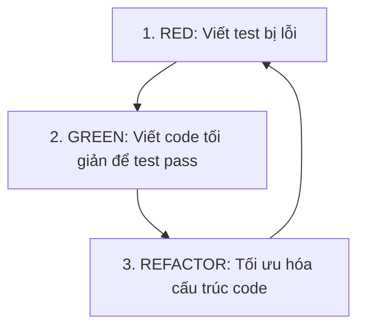

# Tài liệu học tập: Testing Infrastructure & Test-Driven Development (TDD)

Tài liệu này hướng dẫn chi tiết cách thiết lập, vận hành hệ thống kiểm thử tự động và áp dụng phương pháp phát triển hướng kiểm thử (TDD) trong dự án `DynamicDBMigrator`.

---

## 1. Triết lý Test-Driven Development (TDD)

TDD là một phương pháp phát triển phần mềm trong đó bạn viết các ca kiểm thử (test cases) trước khi viết mã nguồn logic của ứng dụng. Chu trình TDD chuẩn bao gồm 3 bước: **Red - Green - Refactor**.



1. **RED (Đỏ)**: Viết một ca kiểm thử cho chức năng mới hoặc hành vi mong muốn. Lúc này, do chưa viết mã nguồn tương ứng, bài kiểm thử chắc chắn sẽ bị thất bại (Red).
2. **GREEN (Xanh)**: Viết lượng mã nguồn tối giản nhất có thể để làm cho bài kiểm thử đó vượt qua (chạy thành công - Green). Bạn không cần quan tâm đến hiệu năng hay clean code ở bước này.
3. **REFACTOR (Tối ưu)**: Khi mã nguồn đã chạy đúng (Green), bạn tiến hành cải tiến cấu trúc code cho sạch đẹp, dễ đọc, loại bỏ trùng lặp mà vẫn đảm bảo bài kiểm thử tiếp tục vượt qua.

---

## 2. Cấu trúc Thư mục Kiểm thử trong Dự án

Dự án thiết lập bộ công cụ kiểm thử với cấu trúc như sau:
- [requirements.txt](file:///d:/Projects/MY-Dragon-agent/LongPd.DynamicDBMigrator/requirements.txt): Định nghĩa các dependencies phục vụ chạy ứng dụng và kiểm thử (như `pytest`, `pytest-cov`, `ruff`, `bandit`).
- [pyproject.toml](file:///d:/Projects/MY-Dragon-agent/LongPd.DynamicDBMigrator/pyproject.toml): Chứa các tham số cấu hình chung cho pytest, ruff linter và bandit.
- [Makefile](file:///d:/Projects/MY-Dragon-agent/LongPd.DynamicDBMigrator/Makefile): Chứa các dev shortcuts giúp chạy nhanh lệnh terminal.
- `tests/`: Thư mục chứa toàn bộ mã nguồn kiểm thử.
  - [conftest.py](file:///d:/Projects/MY-Dragon-agent/LongPd.DynamicDBMigrator/tests/conftest.py): Chứa các shared pytest fixtures (như dữ liệu cấu hình mẫu, file SQL dump mẫu).
  - [test_config.py](file:///d:/Projects/MY-Dragon-agent/LongPd.DynamicDBMigrator/tests/test_config.py): Kiểm thử đối tượng quản lý cấu hình di trú `MigrationConfig`.
  - [test_sql_parser.py](file:///d:/Projects/MY-Dragon-agent/LongPd.DynamicDBMigrator/tests/test_sql_parser.py): Kiểm thử bộ parse file MySQL dump `SQLFileParser`.
  - [test_type_mapper.py](file:///d:/Projects/MY-Dragon-agent/LongPd.DynamicDBMigrator/tests/test_type_mapper.py): Kiểm thử bộ ánh xạ kiểu dữ liệu `TypeMapper`.
  - [test_value_converter.py](file:///d:/Projects/MY-Dragon-agent/LongPd.DynamicDBMigrator/tests/test_value_converter.py): Kiểm thử bộ chuyển đổi giá trị dữ liệu `ValueConverter`.
  - [test_discovery.py](file:///d:/Projects/MY-Dragon-agent/LongPd.DynamicDBMigrator/tests/test_discovery.py): Kiểm thử bộ quét cấu trúc DB `SchemaDiscovery`.
  - [test_web_api.py](file:///d:/Projects/MY-Dragon-agent/LongPd.DynamicDBMigrator/tests/test_web_api.py): Kiểm thử tích hợp các REST API endpoint của Flask.

---

## 3. Cách chạy và Kiểm tra Chất lượng mã nguồn

Bạn có thể chạy các tác vụ này thông qua `make` hoặc gõ lệnh trực tiếp:

### 3.1 Chạy Unit Tests
Lệnh chạy toàn bộ test case và đo lường độ bao phủ (Coverage):
```bash
# Sử dụng Makefile
make test

# Hoặc gõ lệnh trực tiếp
pytest --cov=db_migrator --cov=web --cov-report=term-missing --cov-fail-under=80
```
- `--cov=db_migrator`: Đo lường độ bao phủ mã nguồn trên thư mục `db_migrator`.
- `--cov-report=term-missing`: Hiển thị báo cáo chi tiết các dòng code chưa được kiểm thử phủ tới trực tiếp trên terminal.
- `--cov-fail-under=80`: Buộc chương trình báo lỗi thất bại nếu tổng tỷ lệ bao phủ của toàn dự án dưới 80%.

### 3.2 Linter và Format Code
Sử dụng `ruff` để phân tích tĩnh cú pháp, import, định dạng mã nguồn:
```bash
# Kiểm tra lỗi cú pháp/style
ruff check .

# Tự động định dạng mã nguồn (format code)
ruff format .
```

### 3.3 Quét bảo mật (Security Linter)
Sử dụng `bandit` để tự động dò quét các lỗi bảo mật phổ biến trong code Python (như ghép chuỗi SQL injection, lộ credential, debug mode...):
```bash
# Quét mức độ cảnh báo từ Thấp (Low) trở lên
bandit -r db_migrator web

# Chạy thông qua Makefile
make security
```

---

## 4. Kỹ thuật Mocking trong Kiểm thử

Khi viết unit test cho các tính năng di trú dữ liệu hoặc tương tác API mạng (ví dụ: Google Gemini API), chúng ta **không nên** kết nối đến cơ sở dữ liệu thật hoặc gọi API thật vì các lý do:
- Tốc độ chạy test bị chậm.
- Yêu cầu môi trường phức tạp (phải cài đặt DB, cấu hình kết nối).
- Tốn chi phí API token hoặc phụ thuộc vào kết nối mạng không ổn định.

Để giải quyết vấn đề này, chúng ta sử dụng thư viện `unittest.mock` để giả lập (Mock) hành vi:

### Ví dụ giả lập kết nối MySQL:
```python
from unittest.mock import MagicMock, patch
import mysql.connector

@patch("mysql.connector.connect")
def test_mysql_introspect(mock_connect):
    # 1. Tạo mock connection và mock cursor
    mock_conn = MagicMock()
    mock_cursor = MagicMock()
    
    # 2. Định nghĩa cấu trúc trả về khi gọi hàm
    mock_connect.return_value = mock_conn
    mock_conn.cursor.return_value = mock_cursor
    
    # Giả lập kết quả truy vấn SHOW TABLES
    mock_cursor.fetchall.return_value = [("users",)]
    
    # 3. Thực thi hàm cần test
    # Hàm này sẽ gọi mysql.connector.connect ngầm và nhận về mock object thay vì kết nối thật
    ...
```

Bằng cách áp dụng TDD và bộ kiểm thử tự động này, chúng ta có thể tự tin phát triển các phase tiếp theo (như Cyber Security, AI Agent) và verify ngay lập tức xem hệ thống có bị lỗi hồi quy (regression) hay không.
